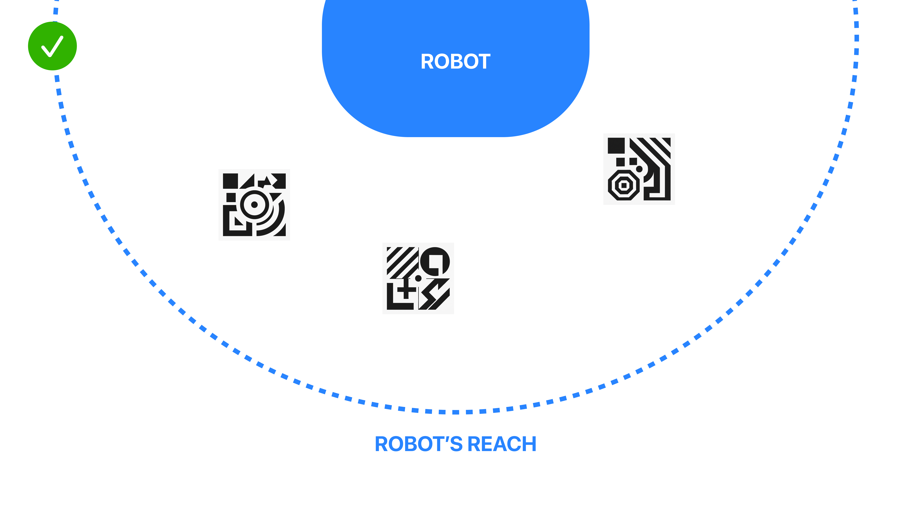

# Using Axys

A step-by-step guide to installing, connecting, calibrating, and manipulating models in Axys.

This article walks you through installing the Rhino plugin, connecting Axys to your headset, running spatial calibration, importing and visualizing models, and syncing any AR adjustments back to Rhino.

---

## 1. Install the Rhino Plugin

### Option 1: Rhino Plugin (Precompiled)

1. Download the plugin from [GitHub](https://github.com/Apollo-ARTE/Axys-RhinoPlugin/releases) and drag the `.rhp` file into Rhino 8.  
2. Restart Rhino if prompted.  
3. Verify the command `****` autocompletes in the Rhino command line.

---

### Option 2: Run from Source (Using Visual Studio or Compatible IDE)
```bash
git clone https://github.com/Apollo-ARTE/Axys-RhinoPlugin.git
```
1. Open the project in Visual Studio or a compatible IDE.  
2. Navigate to the Play (or Run) section.  
3. Click **Run and Debug** to start the project.  
4. In Rhino, run `****`. Note the IP address shown in the console.

---

## 2. Launch the Plugin and Note the IP

```text
Command: AxysStart
Axys Plugin – WebSocket server started on 192.168.1.42:7000
```

Copy the IP address displayed—you’ll enter it in the headset next.

---

## 3. Build & Deploy the visionOS App

1. Open `Axys.xcodeproj`.  
2. Select your device in the run-destination pop-up.  
3. **⌘ R** to build & run. The app appears in the headset’s home view.

---

## 4. Connect Axys to Rhino

1. In Axys, tap **Connect**.  
2. Enter the IP from step 2 and tap **Connect**.  
3. The status should now be **Connected**. If not, check the previous steps and try again.

---

## 5. Import Models

1. In Rhino, select a grouped object.  
2. In Axys, open **Imported Models** and tap **Import**.  
3. The model’s **Name** and **ID** appear in the list; the USDZ downloads automatically.

> At this moment only importing one group at a time is supported. To import multiple objects wait for the previous one to import and select a new one.

> Group related geometry before export; the plugin streams **one group at a time**.

---

## 6. Calibrate to the physical space
The app features a comprehensive built-in, step-by-step calibration process designed to guide users through setup with clear instructions, ensuring precise configuration and optimal performance right from the start.

### 6.1 Place Markers

 

1. Print the markers (check resources to download)
2. Place them in the physical space. Make sure to place the 3 markers in a **non-collinear** layout. At least one marker should sit higher/lower for the tracking to work properly.

### 6.2 Scan Markers

* Toggle **Calibration** → **On**.  
* For each marker: gaze at the marker until the floating sphere snaps to its center, then tap **Next**.  

### 6.3 Enter Robot Coordinates

Move the robot to the center of each marker.  
Enter the XYZ coordinates displayed on the robot controller into Axys, then tap **Done**.

Axys now knows the transform between Rhino and the real world.

---

## 7. Visualize and Edit

1. Select a model in the **Imported Models** list and tap **Visualize**.  
2. The object appears in the lab view; robot reach boundaries (red wireframe) and the virtual-lab shell (blue) can be toggled on/off.

**Move & Rotate**

* Look at the model → pinch to select → a control panel appears.  
* **Move** mode: drag the gizmo or lock axes for precision.  
* **Rotate** mode: rotate around any axis, lock axes if needed.  
* Position and rotation sync to Rhino in real time.

> **Opacity Slider** helps you see through dense geometry when aligning.

---

### Best Practices

* **Stable lighting** — Vision Pro marker detection works best under even illumination.  
* **Small moves in AR** — For large relocations, adjust in Rhino first, then fine-tune in-headset.

---

### Troubleshooting

| Symptom | Fix |
|---------|-----|
| Axys won’t connect | Confirm both devices share Wi-Fi, the Rhyno plugin is running and the IP is correct |
| Model doesn't import | Check model blocking in Rhino. If needed, block the object and re-export |
| Object are not placed correctly in the space | Re-run calibration; ensure marker centers match robot probe points |

---

### Resources

* [AXYS Website](https://github.com/Apollo-ARTE/Axys)  
* [Axys Source](https://github.com/Apollo-ARTE/Axys)  
* [Rhino Plugin Source](https://github.com/Apollo-ARTE/Axys-RhinoPlugin) 
* [Calibration Markers](https://github.com/Apollo-ARTE/Axys) 


