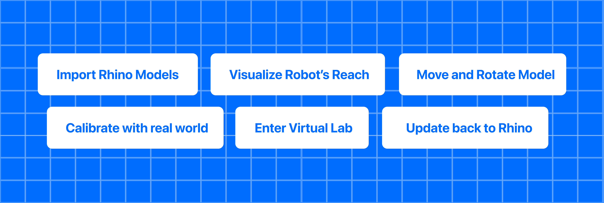

# Axys Rhino Plugin

**Axys** is a **Rhino 8 plugin** that works **in combination with** the [Axys (visionOS app)](https://github.com/Apollo-ARTE/Axys) to bring your Rhino models into a **spatial computing environment**, seamlessly integrating them into the **real world**.

With Axys, you can:
* **Visualize** 3D models in augmented reality at full scale  
* **Calibrate** Rhino’s coordinate system to a physical space with printable markers  
* **Validate** a robot arm’s reach-envelope before the printing session begins  
* **Iterate** rapidly—move or rotate objects in-headset and sync changes back to Rhino in real time  

> Axys is purpose-built for **3D concrete printing (3DCP)** workflows, but its calibration and streaming pipeline can be adapted to any large-scale robotic fabrication setup.

---

## Why Axys?

| Challenge                              | How Axys Helps                                                         |
| -------------------------------------- | ---------------------------------------------------------------------- |
| Mapping digital geometry to real space | Guided marker-based calibration aligns Rhino with the physical lab     |
| Understanding robot constraints        | Live AR overlay of the robot’s workspace and collision boundaries      |
| Rapid design iteration                 | One-tap object export & real-time transform sync back to Rhino          |

---

## Feature Highlights


* **Live Model Streaming** — Export a Rhino object and see it in AR within seconds.  
* **Spatial Calibration** — Printable QR-style markers + a step-by-step in-app guided setup.  
* **Robot Workspace Overlay** — Visualize reach limits and keep prints in-range.  
* **Virtual Space View** — Load a 1 : 1 model of your space to see it in AR.  
* **Real-Time Transform Sync** — Move / rotate in AR, Rhino updates instantly.  

> Non-transform edits (e.g. materials) do **not** stream live—re-export to refresh.

---

## Requirements

| Component | Minimum Version | Notes                                                  |
|-----------|-----------------|--------------------------------------------------------|
| **visionOS** device | 1.0 | Usage of simulator is not recommanded for this product                |
| **Xcode**           | 16  | Run and build the app                                  |
| **Rhino**           | 8   | Install the Axys Rhino Plugin                           |
| **Network**         | —   | visionOS device **and** workstation on the same local network   |

---

## Quick-Start


**Clone & open**
```bash
git clone https://github.com/Apollo-ARTE/Axys-RhinoPlugin.git
```
**Build & run**
1. Open the project in Visual Studio or a compatible IDE.
2. Navigate to the Play (or Run) section.
3. Click Run and Debug to start the project.
4. In Rhino, run **Axys Start**. Note the IP address shown in the console.  
5. Launch **Axys** on the headset and connect entering that IP.  
6. Select a Rhino object and tap **Import** in Axys—the model appears in AR.
7. Follow the calibration setup.
8. Click **Visualize** to enter the visualization mode.

> For step-by-step instructions on connecting, calibrating, and manipulating models, see the [complete article](article.md).

---

### Resources

* [AXYS Website](https://getaxys.netlify.app/)  
* [Axys Source](https://github.com/Apollo-ARTE/Axys)  
* [Rhino Plugin Source](https://github.com/Apollo-ARTE/Axys-RhinoPlugin)
* [Axys Documentation](https://apollo-arte.github.io/Axys/documentation/axys/)
